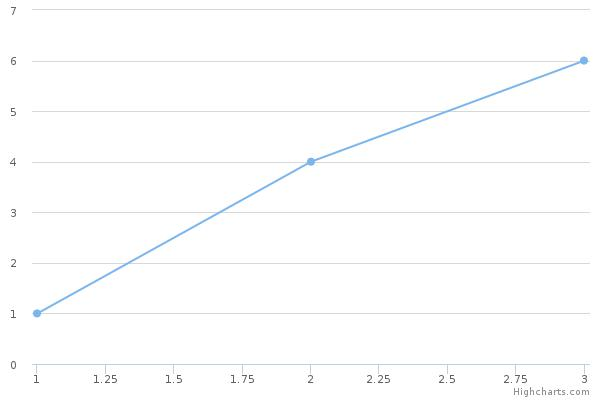

Highcharts в виде сервиса, на который можно отправить данные для генерации графика, а сервис вернет картинку в необходимом формате.

Install dependency
====================
- [nodejs](https://nodejs.org/en/download/package-manager/)
- [bower](https://bower.io/#install-bower)
- [phantomjs 1.9.8](https://bitbucket.org/ariya/phantomjs/downloads/phantomjs-1.9.8-linux-x86_64.tar.bz2)

Run demon
---------
```
~$ bower install
~$ phantomjs-1.9.8-linux-x86_64/bin/phantomjs phantomjs/highcharts-convert.js -host 0.0.0.0 -port 3000
```

[Example send data](example.php)



[README](https://github.com/highcharts/highcharts-export-server/blob/master/phantomjs/readme.md)
